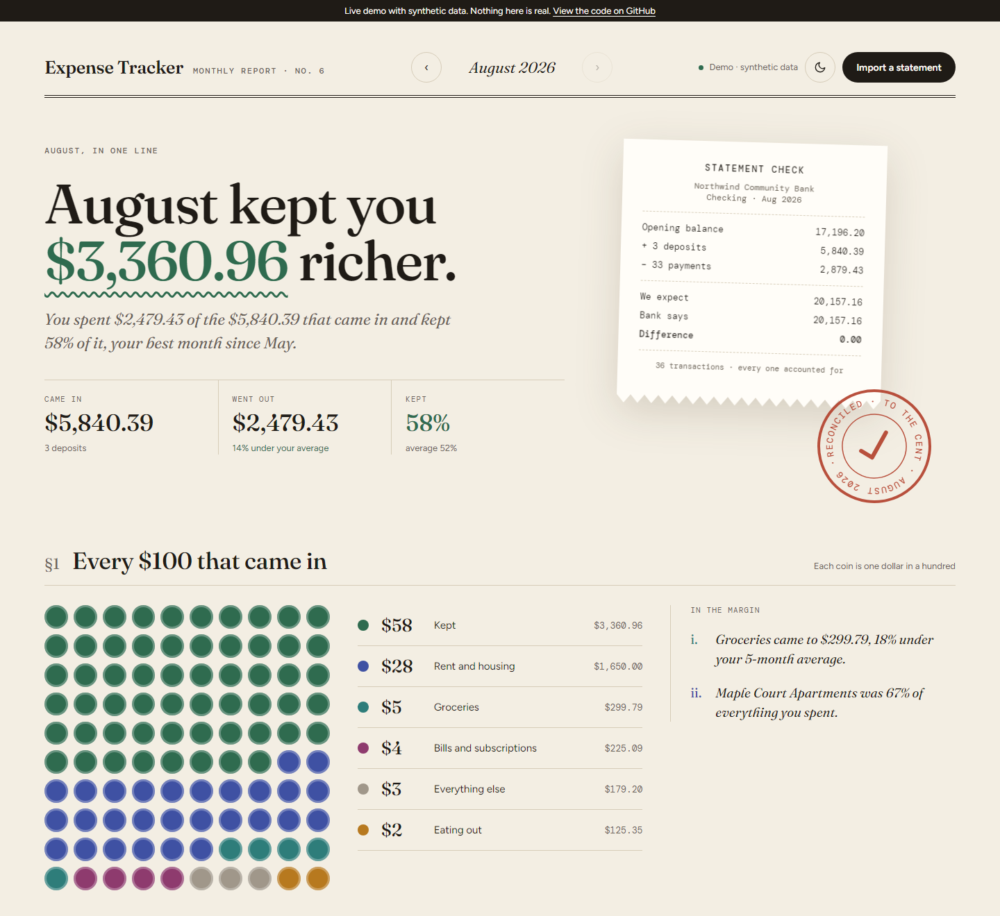
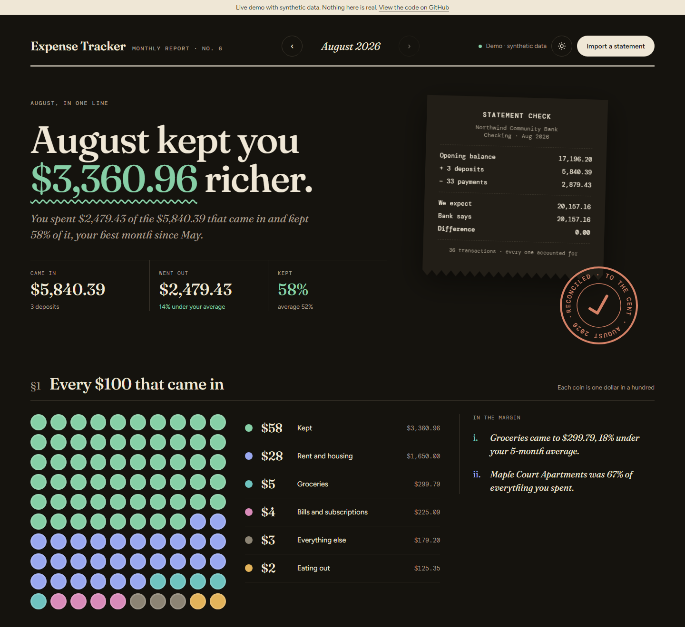
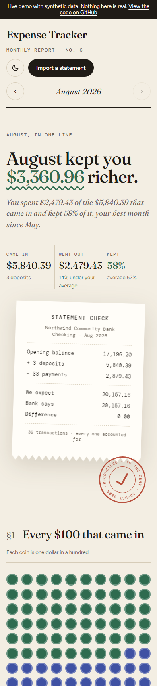
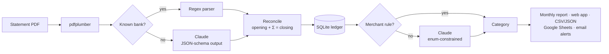

# Expense Tracker

A local-first personal finance app that reads bank statement PDFs from any bank. Recognized banks go through deterministic parsers and everything else through Claude. Every statement is checked against its own opening and closing balances, so a missed or misread transaction shows up as a warning instead of a wrong total.

[](https://github.com/mnguyen38/Expense-Tracker/actions/workflows/ci.yml)


**[Live demo](https://mnguyen38.github.io/Expense-Tracker/)** (synthetic data) · or run `expense-tracker demo` locally, no API key needed.



Every bank formats its statements differently, so hand-written parsers keep breaking and fully AI-read numbers are hard to trust. This app handles both problems:

- **Reads any statement.** A fast regex parser handles banks it knows. For any other format, Claude extracts the transactions into a strict JSON schema.
- **Proves the numbers.** Each statement's transactions must add up to the difference between its opening and closing balances. If they don't, you get a clear warning instead of silently wrong totals.
- **Learns your categories and names.** Claude categorizes each new merchant once and gives it a readable name ("WHOLEFDS SYM 10031" becomes "Whole Foods"). Both are saved, and your own corrections and renames always win. Next month's statement usually needs few or no API calls.
- **Keeps your data local.** Everything lives in a SQLite file on your machine. Only two things go to the Claude API: the text of statements from banks with no built-in parser, and the names of merchants it hasn't seen before, with account-holder names and reference numbers stripped out first. Google Sheets and Gmail are optional extras.

## Quick start

```bash
git clone https://github.com/mnguyen38/Expense-Tracker.git
cd Expense-Tracker
pip install .                     # Python 3.11+

expense-tracker demo              # six months of synthetic data, opens the monthly report
```

With your own statements:

```bash
expense-tracker init              # creates ~/.expense-tracker with an editable config.toml
echo "ANTHROPIC_API_KEY=sk-ant-..." >> ~/.expense-tracker/.env

expense-tracker import ~/Downloads/statements/
expense-tracker serve             # web app: drag in PDFs, fix categories, explore
```

## What it looks like

Each month reads like a printed report:
- **The headline:** what you kept, compared with your own history.
- **The statement check:** a receipt and stamp showing whether the statement reconciles. When it doesn't, the stamp says "check needed" and shows the difference.
- **Every $100 that came in:** where the money went, as 100 coins.
- **The diary:** a calendar of daily spending.
- **How the month was sorted:** saved rules vs Claude.
- **The ledger:** every transaction, with categories you can fix in one click.

| Dark mode | Phone |
|---|---|
|  |  |

```text
$ expense-tracker import examples/sample_statement.pdf
Importing sample_statement.pdf ... done in 8s
  Northwind Community Bank | checking | Mar 2026
  19 transactions: 15 expenses, 3 income
  ✓ Balances reconcile: every transaction is accounted for

Categorizing 15 expenses...
  0 from saved rules, 15 by Claude (15 new merchants)

==================================================
MAR 2026 SUMMARY
==================================================
Total Spending: $2,377.21
Total Income:   $5,795.80
Net:            +$3,418.59
```

[`examples/sample_statement.pdf`](examples/sample_statement.pdf) is a synthetic statement from a fictional bank that no parser was written for. All 19 transactions come out, the $400 transfer to savings is recognized as internal and kept out of spending, and the balances reconcile. The result is in [`examples/sample_output.json`](examples/sample_output.json).

## How it works



### Making LLM extraction trustworthy

- **Structured outputs.** Extraction and categorization use Claude's `output_config` JSON-schema mode, so replies always parse. Categories are an `enum` built from your config, so the model can't invent one.
- **Balance reconciliation.** `opening + Σ transactions = closing` (reversed for credit cards, where the balance is money owed). A mismatch means a transaction was dropped or misread. It's flagged in the CLI, in the web app, and on the statement's row. On the author's real Bank of America statements (a credit card with 91 transactions, and a checking account) both reconcile to the cent.
- **No silent truncation.** The whole statement is sent. If a reply hits the token limit or the model declines, the import fails loudly.
- **Idempotent imports.** Files are identified by SHA-256, so importing a folder twice changes nothing. When a month's statement arrives, it replaces any email-alert estimates for that month, so nothing is double counted.

## Commands

| Command | What it does |
|---|---|
| `expense-tracker demo [--serve]` | Try it with synthetic data; never touches your real ledger |
| `expense-tracker init` | Create the data directory and `config.toml` |
| `expense-tracker import PATH...` | Import PDFs or folders (`-m 1/2026` to set the month, `--force` to redo) |
| `expense-tracker serve` | Local web app on `127.0.0.1:8765`: drop in PDFs, read the report, fix categories |
| `expense-tracker report [--open]` | Write the monthly report as one self-contained HTML file |
| `expense-tracker summary [-m M/YYYY]` | Month summary in the terminal |
| `expense-tracker transactions` | List transactions with ids (`-c`, `-s` to filter) |
| `expense-tracker categorize ID CATEGORY` | Fix a category; the merchant is remembered |
| `expense-tracker rules [--delete KEY]` | Show or remove learned merchant rules |
| `expense-tracker names [--redo]` | Give every merchant a clean name ("PL*StateFinancia DES:WEB…" → "State Financial") |
| `expense-tracker rename ID "Name"` | Show a merchant under your own name (or click the name in the web app) |
| `expense-tracker export [-f csv\|json]` | Export transactions |
| `expense-tracker sync-sheets` | Write a month into the [Google Sheets budget template](https://docs.google.com/spreadsheets/d/1SB7cCd_Rk9HHEtjDYb_mGKYBR-68Y-Dqe1IuPMHQg_E/copy) |
| `expense-tracker gmail [--days N]` | Import Bank of America alert emails between statements |
| `expense-tracker email-summary` | Email an HTML spending summary |

`import` also emails an alert whenever the current month's spending crosses a multiple of `alert_threshold`, if email is configured. Importing older statements never sends alerts about past months.

## Configuration

`expense-tracker init` writes `~/.expense-tracker/config.toml`. Set `EXPENSE_TRACKER_HOME` or pass `--home` to use another location:

```toml
model = "claude-sonnet-5"      # model for extraction and categorization
statement_close_day = 31       # e.g. 11 if your statements close on the 11th
alert_threshold = 1000         # email when spending crosses each $1,000 (0 = off)
currency_symbol = "$"
sheets_id = ""                 # optional Google Sheet

[categories]                   # name = hint for the AI; edit freely
Housing = "rent, mortgage, property-related costs"
Groceries = "supermarkets and grocery stores"
"Eating Out" = "restaurants, cafes, bars, food delivery"
# ...
```

Secrets go in `.env`, either in the data directory or the current directory:

| Variable | Needed for |
|---|---|
| `ANTHROPIC_API_KEY` | Importing statements from unrecognized banks, and categorizing new merchants |
| `NOTIFY_EMAIL`, `SMTP_EMAIL`, `SMTP_PASSWORD` | Email summaries and alerts |
| `GOOGLE_SHEET_ID`, `GOOGLE_CREDENTIALS_PATH` | Sheets sync (`pip install ".[google]"`; service-account JSON, default `~/.expense-tracker/credentials.json`) |

Gmail import needs an OAuth desktop client saved as `~/.expense-tracker/gmail_credentials.json`.

## Adding a bank parser

Drop a file into `src/expense_tracker/parsers/`. Any class ending in `Parser` with `detect` and `parse` methods is discovered automatically, and a confident `detect` score means that bank never goes to the LLM:

```python
# src/expense_tracker/parsers/chase.py
from .base import BaseParser, ParseResult


class ChaseParser(BaseParser):
    bank_id = "chase"
    bank_name = "Chase"

    def detect(self, text: str) -> float:
        return 1.0 if "JPMorgan Chase" in text else 0.0

    def parse(self, pdf_path, text) -> ParseResult:
        result = ParseResult(...)
        result.reconcile()  # adds a warning if the balances don't add up
        return result
```

## Development

```bash
pip install -e ".[dev]"
python -m playwright install chromium  # once, for the browser tests (or use your installed Chrome)
pytest --cov                          # 350 tests, no network or API key needed
ruff check . && ruff format --check .
python scripts/build_demo_page.py     # rebuild docs/index.html (the live demo)
```

The tests include end-to-end runs that render real PDFs and push them through pdfplumber, the parsers, the ledger, the CLI and the web server's HTTP API, including its CSRF and DNS-rebinding protections. Browser tests drive the report with real mouse, keyboard and touch input at desktop, tablet and phone widths: clicking, dragging and unselecting days, the bottom sheet, auto-scroll. CI runs lint, the tests and a CLI smoke test on Python 3.11 to 3.13.

```
src/expense_tracker/
├── cli.py           `expense-tracker` commands
├── pipeline.py      import → store → categorize → sync, shared by CLI and web app
├── ledger.py        SQLite storage, merchant rules, month summaries
├── parsers/         bank detection, regex parsers, Claude fallback, reconciliation
├── categorizer.py   batched, enum-constrained categorization
├── llm.py           Claude client with structured outputs
├── report.py        the monthly report (one self-contained HTML page)
├── web.py           local web app (standard library only)
├── demo.py          synthetic data for `demo` and the live demo page
├── config.py        config.toml and data directory
├── sheets.py        Google Sheets sync
├── gmail.py         Gmail alert import
└── notifications.py email summaries and alerts
```

## License

MIT, see [LICENSE](LICENSE). The report embeds the fonts Fraunces, Figtree and DM Mono, subset by `scripts/build_fonts.py`. They're licensed under the SIL Open Font License 1.1; see [`licenses/`](licenses/).
